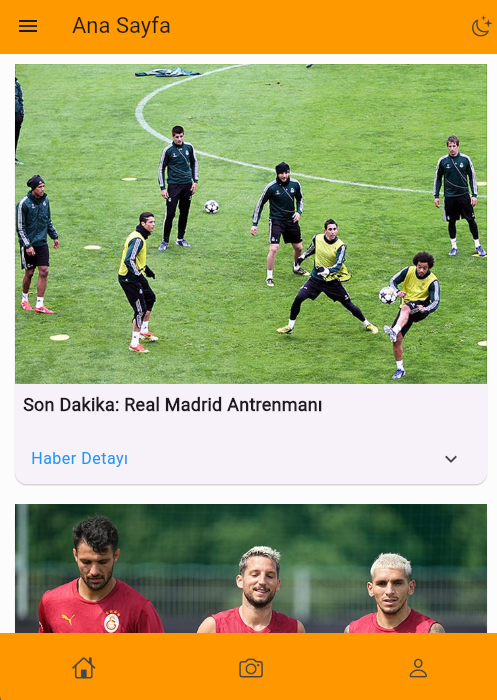
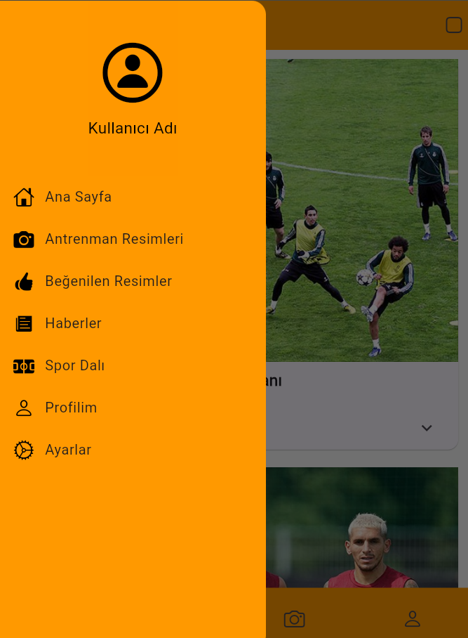
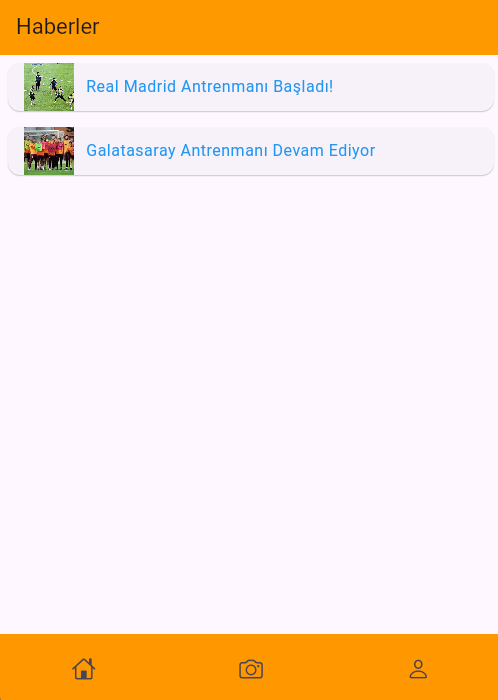
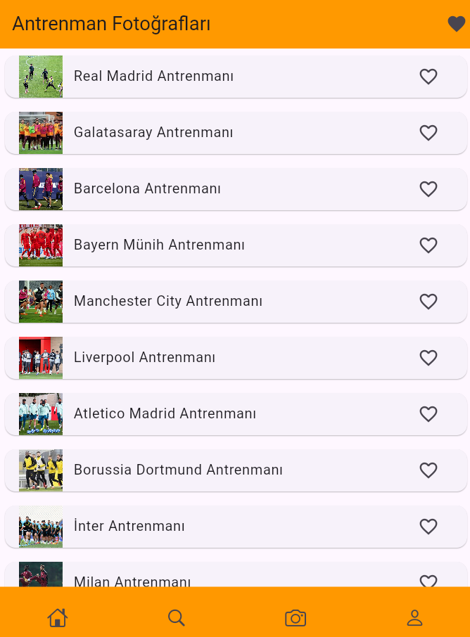
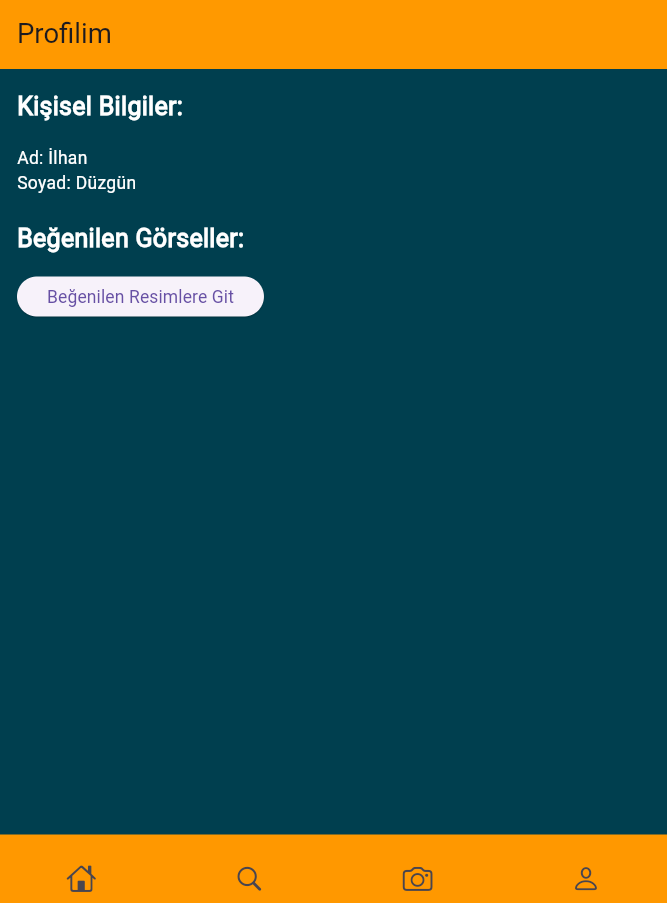

# Flutter Projesi 

## Proje Hakkında 
[Bu projede kullanıcılar Türkiyede ve Dünyada spor haberleri hakkında bilgi sahibi olabilecekler. Ayrıca futbol takımlarının antreman fotoğraflarını görüp, günün haberlerini beğenebilecekler.]

## Ekip
-  **Danışman:**
 Keyvan Arasteh [https://github.com/keyvanarasteh](https://github.com/keyvanarasteh)
-  **Takım Üyeleri:**

## Ana Özellikler
- [Programda açık ve koyu tema olacak]
- [Programda haberleri beğenme özellikleri olacak]
- [Programda branş seçme olacak]
- [Programda İngilizce ve Türkçe dil desteği olacak]
- [Programda antrenman görselleri görülebilecek ve beğenilebilecek]

## Kullanılan Teknolojiler
- Flutter 
- Dart  

## Başlangıç

## Kurulum Adımları
1. Projeyi bilgisayarınıza indirin:
'''bash
git clone [proje - adresi]
'''

2. Proje Klasörüne gidin:
'''bash
cd [Flutter - SPORT_AGENDA.FLUTTER]
'''

3. Gerekli paketleri yükleyin
'''bash
flutter pub get
'''

## Projeye Katkı Sağlama
1. Projeyi forklayın 
2. Yeni bir dal oluşturun ('git checkout -b Ozellik/YeniOzellik')
3. Değişikliklerinizi kaydedin ('git comit -e 'yeni ozellik eklendi'')
4. Dalınıza gönderin ('git push origin ozellik/yeniozellik')
5. Pull request oluşturma

## Proje Yapısı
lib/

├── modeller/ # Veri modelleri

├── ekranlar/ # Uygulama ekranları
- home_screen.dart
- like_screen.dart
- loading_screen.dart
- login_screen.dart
- news_screen.dart
- photo_scren.dart
- profile_screen.dart
- register_screen.dart
- search_screen.dart
- sport_screen.dart

├── widgets/ # Tekrar kullanılabilir arayüz öğeleri

├── servisler/ # API servisleri

└── yardımcılar/ # Yardımcı fonksiyonlar

# Ekran Görüntüleri

# Tanıtım videosu

## Lisans 
[MIT License] kapsamında lisanslanmıştır. Daha fazla bilgi için 'LICENSE' dosyasını inceleyebilirsiniz.

## İletişim
- Proje Bağlantısı: [https://github.com/ilhandzgn]
- İstinye Üniversitesi: [https://www.istinye.edu.tr/tr](https://www.istinye.edu.tr/tr)

## Teşekkürler

- Başta Öğretmenimiz Sayın Keyvan Arasteh'e ve İstinye Üniversitesi'ne destekleri için teşekkür ederim. 